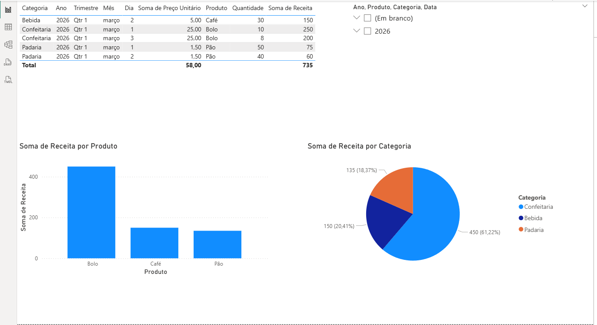

#  Dashboard de Análise de Vendas

Projeto desenvolvido com Power BI para análise de dados.

# Ferramentas
- Power BI
- Excel

#  Funcionalidades
- Receita por produto, categoria e data
- KPIs: Receita Total, Volume de Vendas, Ticket Médio
- Filtros interativos

# Insights
- Produto com maior receita: Bolo
- Categoria dominante: Confeitaria
## 📷 Dashboard

